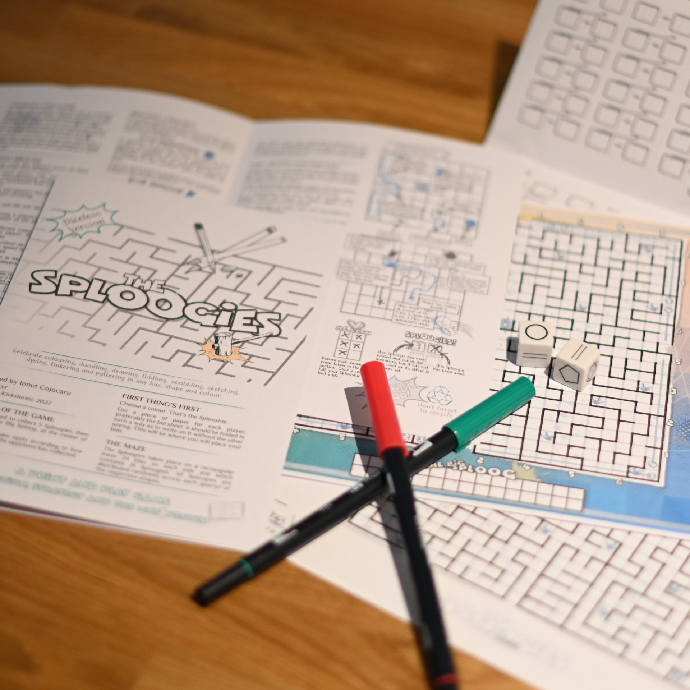

**ACTION | STRATEGY | THE UNEXPECTED**

A fast paced, strategic yet chaotic roll and write game. Funded on Kickstarter, after a few adventures, in August 2022.



**2+ PLAYERS**

**20-30 MINUTES**

***

The are two version of The Sploogies: one with dice, and the other... well, without dice. The purpose of the game is to collect a minimum of 5 Sploogies, then defeat The Big Sploog at the centre of the maze. Or be the last one standing. 

But a lot can happen when you get a Sploogie...

Highly replayable. In addition, the PnP board is a configurable PDF containing 10,000 unique mazes and 25,000 unique game configuration.



Find below the whole story behind The Sploogies.