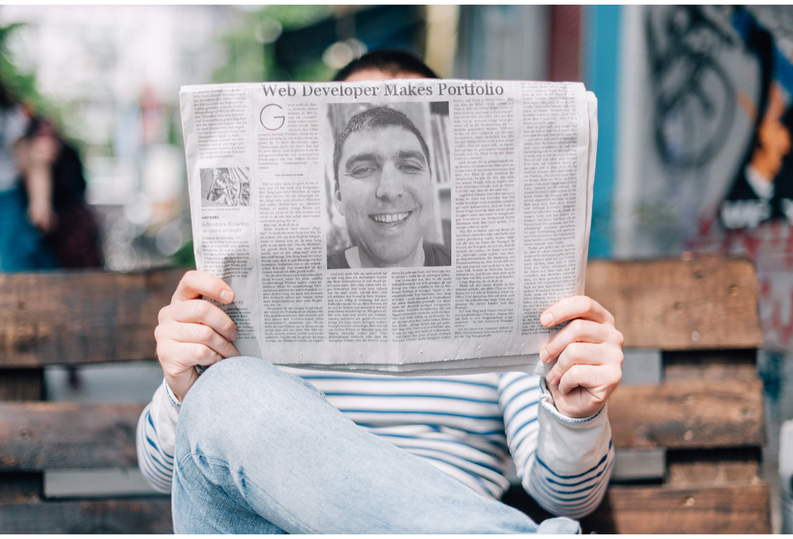
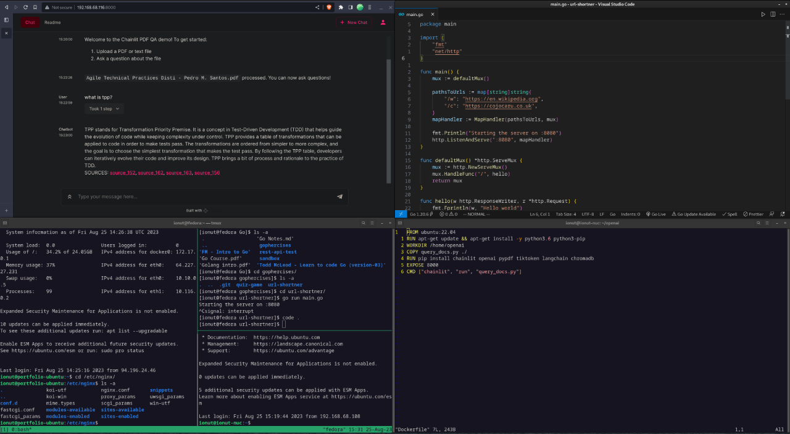
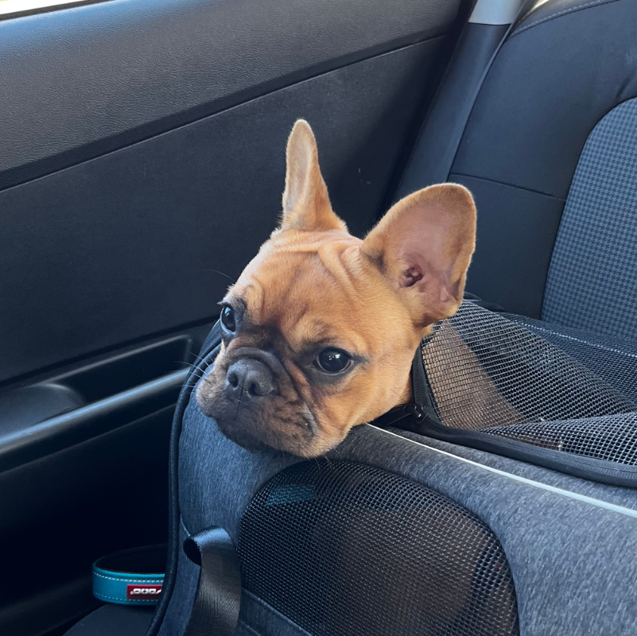

# Oh, hello again

***
&nbsp;
## Nice to see you here

Have you noticed how personal websites have become impersonal single-page affairs, more like on-line resumes? I for one, still believing in the *personal website*, have taken the middle way, and added this (somewhat) hidden, but more personal, second page. 

In fact, this website aims to serve a double purpose, which hopefully can be reconciled: to be your regular portfolio page, but also a personal website, and used for various purposes (including playing around with Hugo). As a result, there are other pages apart from this one, which are not publicly linked.





By the why, my name is pronounced *yo-noots*. Just imagine that the words *you* and *donut* had a baby.

My surname is *Cojocaru* (pronounced something like *ko-zho-ka-roo*)

&nbsp;

## So, why coding?
***


Although I take with the grain of salt the idea that technology was the best thing that happened to the human race since the Bing Bang, there's no denying that this is the first time in history when we finally got to practicing magic. Not the old-school, Harry Potter, make-believe kind of magic, but actual, real life, *meaningful* magic: we might not have flying cars, but we have self-driving ones; we might not have teleportation, but we can communicate in real time regardless of the distance.

For me, the craziest thing is the *alchemy* behind it all: being able to do virtually anything, and change anything into anything else by simply manipulating some written symbols. Crazy, isn't it?

But before we get too philosophical, let's not forget about the simple craftsman's pleasure of making thing. Things that others will use, or things made simply for the pleasure of making them.

&nbsp;

## My Setup
***


I daily run Fedora with Gnome, alongside a Ubuntu bare metal home server and a Digital Ocean VPS. I generally write my stuff in VSCode, with the Vim extension. When I work in JavaScript my dev environment consists of TypeScript, Prettier, a11y, and the Airbnb ESLint extension.

### Languages
My main language is JavaScript, but I also work in Python, do Bash scripts and use a bit of YAML. And of course, Go.

### Frameworks
I work in React, of course, and its offshoots, NextJS and React Native. I also make static websites, such as this one, in Hugo. As a refresher, Hugo uses Go under the hood, and markdown as its source of content.

### Databases
My databases of choice are MongoDB and PostgreSQL.

### The backend
I use Nginx as proxy on a Digital Ocean server. I sometimes use Docker containers.

Above is a pic of my glorious current workflow. In the top-left corner is a containerized instance of LangChain, an LLM framework running ChatGPT via ChainLit, from my local bare metal server. The beauty of this is that you can feed ChatGPT your own inputs, such as PDFs, and it replies with tne information contained there.

In the top-right corner is a simple Go server which acts as an url shortener. 

In the bottom-left corner is an instance of tmux, showing my two servers and the url shortener on my local machine.

Last but not least, in the bottom-right corner is the Dockerfile for the ChainLit container.

&nbsp;

## When I don't code
***


I cook, usually light meals like salads and pasta, I spend time with a very mediocre brown dog called Ori, read, and--less often than I wish--play board games. Every now and then I pick up my Nintendo Switch, wipe off the dust on it and recharge it before I put it back in the drawer.

As a part-time hobby I also run a project called *Artifices*, which does a combination of things, from zines to print-and-play games, and to [**planting a forest**](https://ecologi.com/artifices). So far, I've managed to plant 600 trees.

When I don't do any of this stuff, I'm probably out hiking. I know every rock and pond in North Snowdonia. The place where I always return is Nant y Geuallt and the area between Vlogwyn Mawr and Craig Wen. In 2019 I left £5 in a broken bottle I found on the summit of Craig Wen. It was still there in 2022. It disappeared (bottle included) in 2023. When time permits, I'm out to Scotland, preferably as far north as possible.

