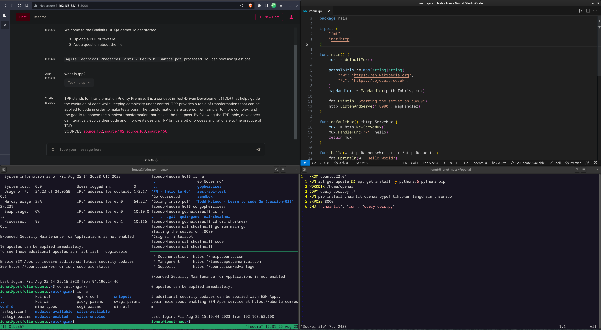

## Oh, hello again
### Nice to see you here

Have you noticed how personal websites have become impersonal single-page affairs, more like on-line resumes? I for one, still believing in the *personal website*, have taken the middle way, and added this (somewhat) hidden, but more personal, second page. 

###

## So, why coding?

Although I take with the grain of salt the idea that technology was the best thing that happened to the human race since the Bing Bang, there's no denying that this is the first time in history when we finally got to practicing magic. Not the old-school, Harry Potter, make-believe kind of magic, but actual, real life, consequential magic: we might not have flying cars, but we have self-driving one; we might not have teleportation, but we can communicate in real time regardless of the distance.

For me, the craziest thing is the *alchemy* behind it all: being able to do virtually anything, and change anything into anything else by simply manipulating some written symbols. Crazy, isn't it?

But before we get too philosophical, let's not forget about the simple craftsman's pleasure of making thing. Things that others will use, or things made simply for the pleasure of making them.

## My Setup

I daily run Fedora with gnome, alongside a Ubuntu bare metal home server and a Digital Ocean VPS. I generally write my stuff in VSCode, with the Vim extension, and when I work in JavaScript my dev environment consists of TypeScript, Prettier, a11y, and the Airbnb ESLint extension.

### Languages
JavaScript is my main language, but I also work in Python, do Bash scripts and use a bit of YAML. And of course, Go.

### Databases
My databases of choice are MongoDB and postgreSQL.

### The backend
I use ngnix as proxy with a Digital Ocean server. I sometimes use Docker containers.

Below is a pic of my glorious current workflow, with the langchain container, local server, vps and tmux in action, and a sprinkle of Go for good measure.

